# Conecta++

Sistema web desenvolvido para auxiliar ONGs no gerenciamento de idosos atendidos, oferecendo uma plataforma para cadastro, administração e acompanhamento de informações, além de conteúdos informativos e recursos de acessibilidade.


---

## Sobre o projeto

O Conecta++ foi desenvolvido em equipe como projeto acadêmico do curso de Análise e Desenvolvimento de Sistemas.

O sistema tem como objetivo facilitar o gerenciamento de informações de idosos atendidos por uma ONG, permitindo o cadastro de usuários, gerenciamento de administradores e atendentes, controle de interesses e acesso a conteúdos informativos relacionados à saúde e prevenção de golpes.

Além das funcionalidades administrativas, o projeto foi desenvolvido com foco em organização, usabilidade e acessibilidade.

---

## Funcionalidades

* Cadastro de idosos;
* Login de administradores e atendentes;
* Gerenciamento de administradores;
* Gerenciamento de atendentes;
* Cadastro e gerenciamento de interesses e necessidades;
* Consulta e atualização de registros;
* Conteúdo sobre prevenção de golpes;
* Lembretes de saúde;
* Página "Nossa História";
* Recursos de acessibilidade com VLibras.

---

## Tecnologias utilizadas

### Back-end

* C#
* ASP.NET Core MVC (.NET 8)
* SQL Server
* Entity Framework Core

### Front-end

* HTML5
* CSS3
* JavaScript
* Bootstrap

### Banco de Dados

* SQL Server
* Script SQL para criação do banco de dados.

---

## 📁 Estrutura do repositório

```text
ConectaPlusPlus
├── Backend
├── Frontend
├── BancoDeDados
├── Imagens
└── README.md
```

---

## Telas do Sistema

<table>

<tr>
<td align="center">
<b>Tela Inicial</b><br>
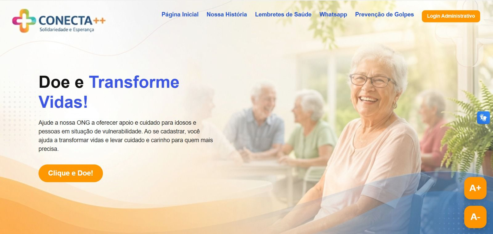
</td>

<td align="center">
<b>Nossa História</b><br>
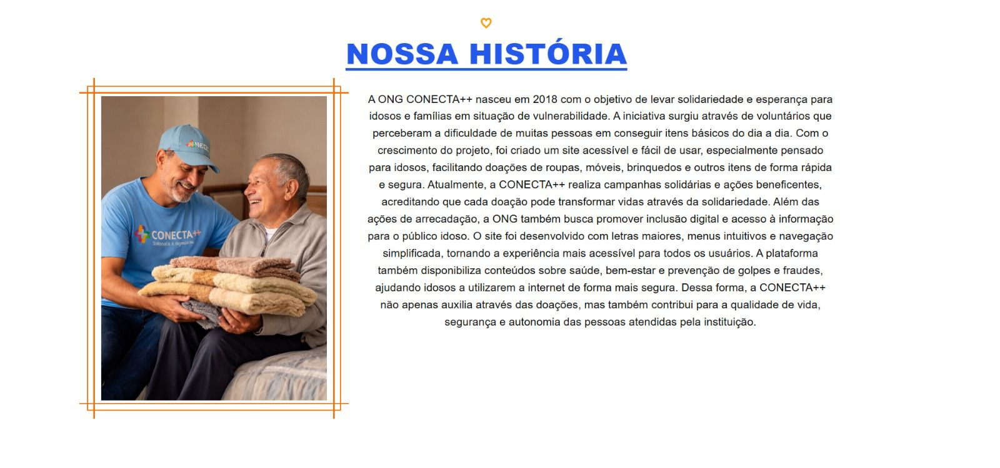
</td>
</tr>

<tr>
<td align="center">
<b>Lembretes de Saúde</b><br>
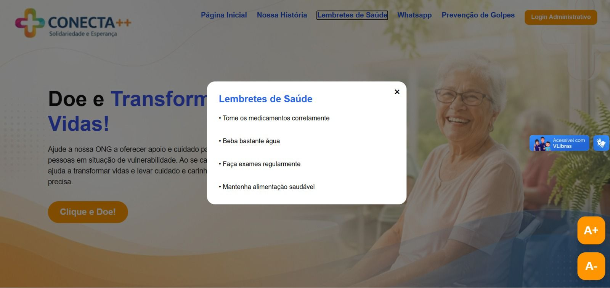
</td>

<td align="center">
<b>Prevenção de Golpes</b><br>
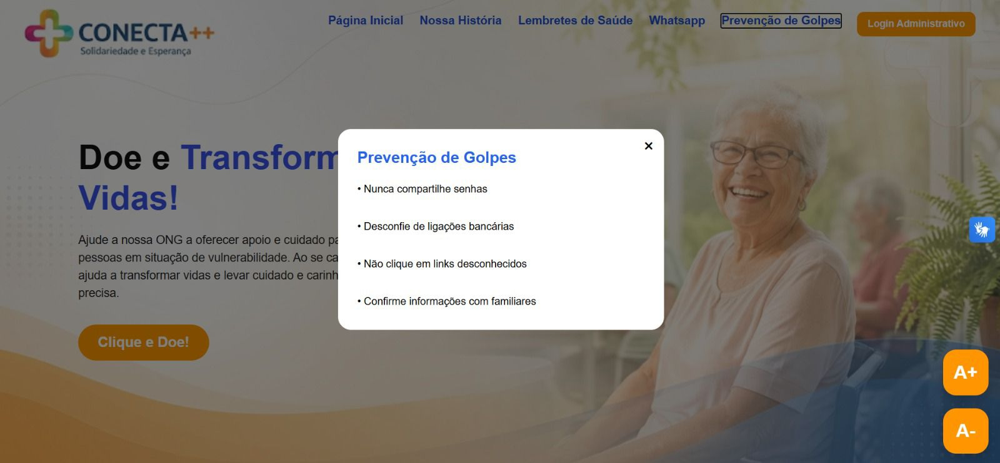
</td>
</tr>

<tr>
<td align="center">
<b>Painel Administrativo</b><br>
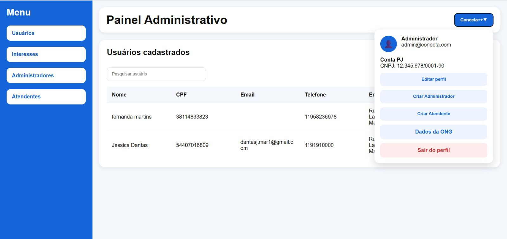
</td>

<td align="center">
<b>Painel do Atendente</b><br>
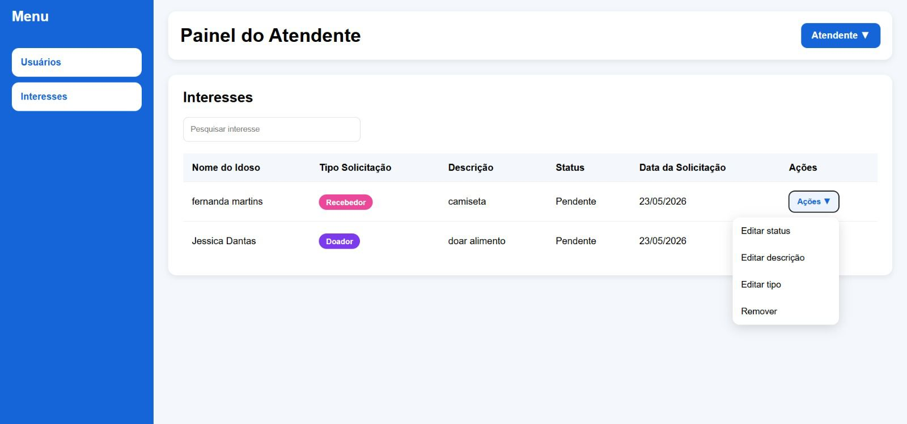
</td>
</tr>

<tr>
<td align="center">
<b>Cadastro - Etapa 1</b><br>
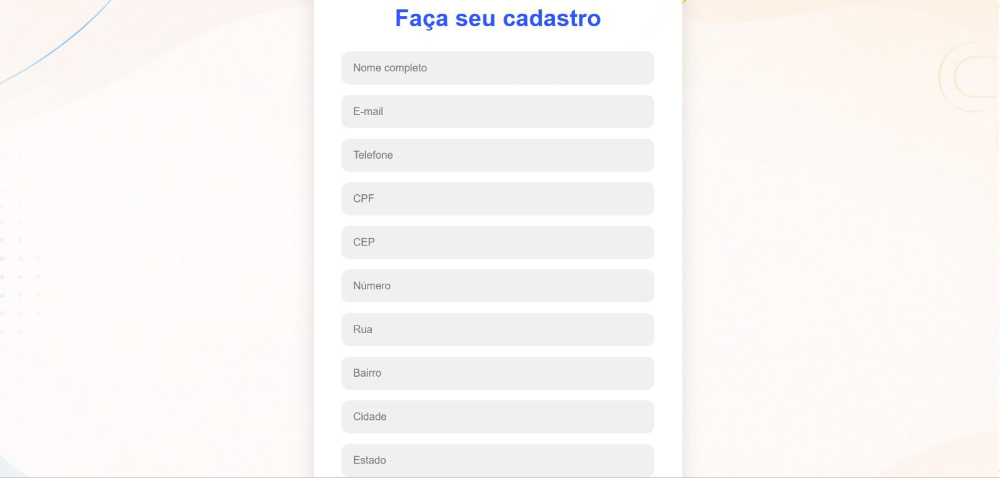
</td>

<td align="center">
<b>Cadastro - Etapa 2</b><br>
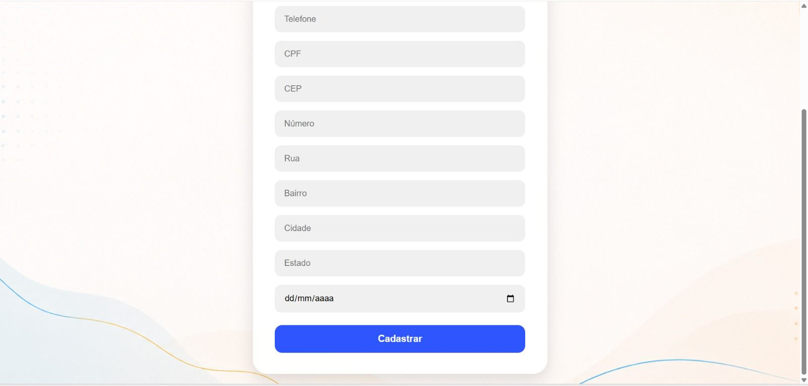
</td>
</tr>

<tr>
<td align="center">
<b>Tipo de Interesse</b><br>
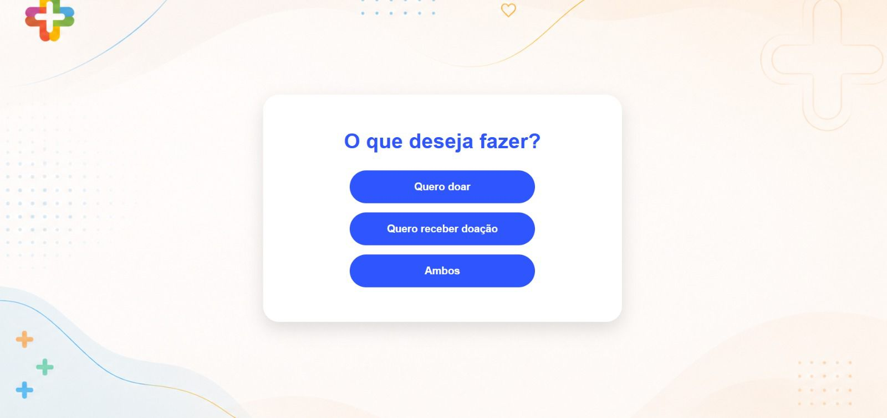
</td>

<td align="center">
<b>Tipo de Necessidade</b><br>
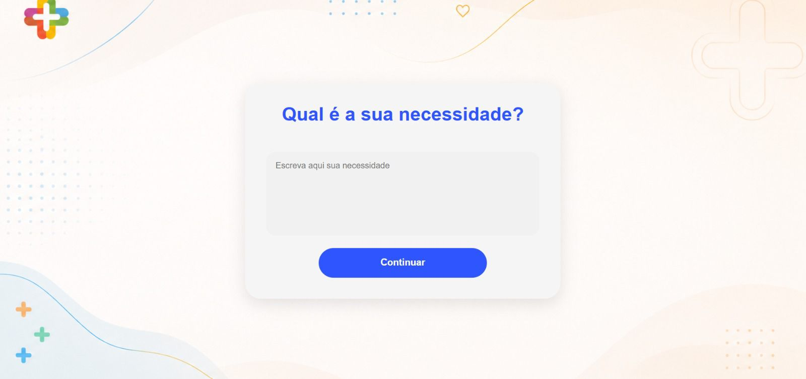
</td>
</tr>

<tr>
<td align="center">
<b>Cadastro Concluído</b><br>
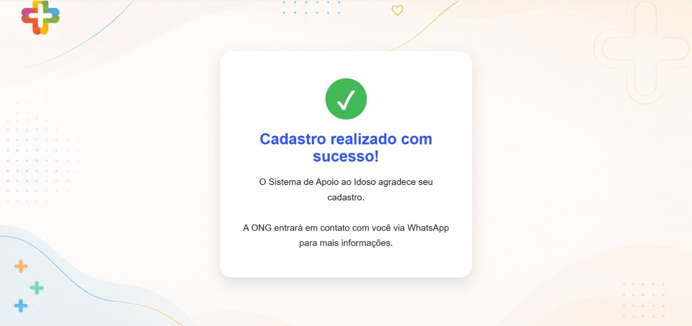
</td>

<td></td>
</tr>

</table>

---

## Como executar o projeto

1. Clone este repositório.
2. Execute o script localizado na pasta **BancoDeDados** para criar o banco de dados.
3. Configure a conexão com o SQL Server no arquivo `appsettings.json`.
4. Abra o projeto no Visual Studio.
5. Execute a aplicação.

---

## Equipe

Projeto desenvolvido em equipe como parte das atividades do curso de Análise e Desenvolvimento de Sistemas.

Este repositório foi publicado por **Yasmim Tomas** como parte de seu portfólio profissional.
